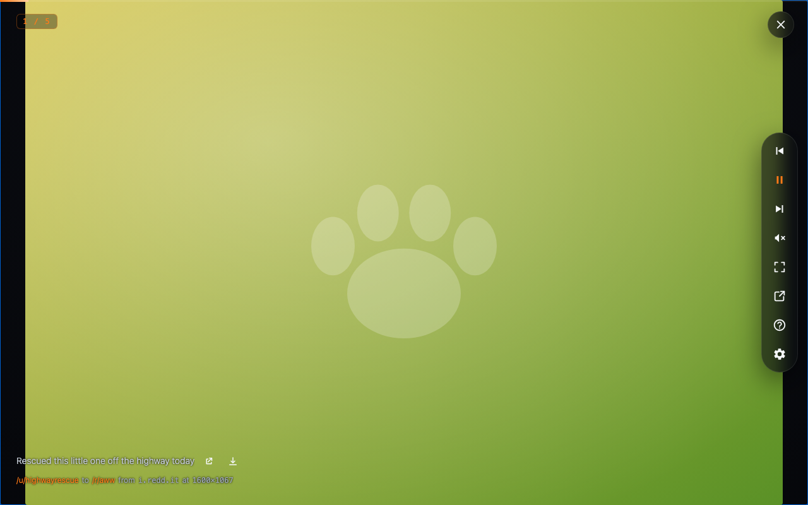

# Reddit Slideshow Spectacular!

A full-screen, keyboard-driven slideshow of the images and videos in **your own
Reddit** - the feed you're already looking at. Open your Home feed, a community
you've joined, one of your Custom Feeds (multireddits), any subreddit, your saved
posts, or a search on `old.reddit.com` or `www.reddit.com`, hit the toolbar icon
(or **Alt+Shift+S**), and that exact view becomes the slideshow.

**Private, and built on your existing setup.** It reuses your logged-in Reddit
session - no API keys, no separate account, nothing to re-subscribe to - and runs
entirely in your browser. No analytics, no tracking, no developer servers (there
are none); your settings stay on your device. It plays direct images, galleries,
Reddit-hosted video, Redgifs, Imgur, Streamable, Giphy, Catbox, and crossposts.

**Made for the big screen.** Pop the slideshow out into its own window, then
AirPlay or Chromecast that window to your TV for a hands-off, lean-back feed.

<a href="docs/slideshow-demo.png">
  
</a>

## Features

- Launch from any `old.reddit.com` or `www.reddit.com` feed via the toolbar icon
  or **Alt+Shift+S** - it starts at the post nearest your scroll position.
- Auto-advance on a timer or arrow through manually; videos advance when they end.
- Pages forever - follows Reddit's pagination so the show keeps going.
- Per-kind rendering: `` for images/galleries and native `<video>` for
  `v.redd.it`, Redgifs, Imgur, Streamable, Giphy, and Catbox.
- Skips duplicates (reposts, crossposts, repeated galleries) and broken media.
- Lots to tune from the overlay's gear, applied live with no reload - see
  [Settings](#settings).

## Settings

Tune it from the gear in the overlay or the full options page - changes apply
live, no reload:

- **Seconds per image** - and how long to wait for slow media before skipping it
- **Slide transition** - fade, slide, push, zoom, flip, or none
- **Top countdown bar** - on video slides, every slide, or never
- **Autoplay videos** and **start muted**
- **Include NSFW** - follows your logged-in Reddit session by default
- **Skip duplicates** - reposts, crossposts, repeated galleries, and (on by
  default) the same image re-uploaded under a new link, via a local perceptual
  hash
- **Pan & zoom** for images too big to see at once - a slow push-in and drift
  across, with full control of the sequence
- **Always show the position counter & title**

> Maintainer note: `npm run screenshots` regenerates the add-on-store assets - a
> slideshow shot plus the options page in light and dark. The Chromium binary
> isn't fetched by `npm install`, so run `npx playwright install chromium` once
> first.

## Install

It isn't on the Firefox Add-ons site or the Chrome Web Store yet, so you load the
built extension yourself. This runs it in **your** browser, using your real
(logged-in) Reddit session.

First build it:

```sh
npm install
npm run build         # Firefox → .output/firefox-mv3/
npm run build:chrome  # Chrome  → .output/chrome-mv3/
```

### Firefox

1. Open `about:debugging#/runtime/this-firefox`.
2. Click **Load Temporary Add-on…** and pick
   `.output/firefox-mv3/manifest.json`.
3. After code changes, re-run `npm run build` and click **Reload**.

Temporary add-ons are removed when you restart Firefox - just load it again. For
a permanent install, use Firefox Developer Edition / Nightly / ESR, set
`xpinstall.signatures.required` to `false` in `about:config`, then install the
`npm run zip` package from `about:addons` → **Install Add-on From File…**.

### Chrome (also Edge, Brave, other Chromium browsers)

1. Open `chrome://extensions`.
2. Turn on **Developer mode** (toggle, top-right).
3. Click **Load unpacked** and select the **folder** `.output/chrome-mv3/`
   (the folder itself, not a file inside it).
4. Click the toolbar's puzzle-piece icon and pin **Reddit Slideshow Spectacular!**.
5. After code changes, re-run `npm run build:chrome` and click the **↻ reload**
   icon on the extension's card in `chrome://extensions`.

Unlike a Firefox temporary add-on, a Chrome unpacked extension stays installed
across restarts (Chrome shows a "disable developer-mode extensions" prompt on
startup that you can dismiss).

## Use

- Open an `old.reddit.com` or `www.reddit.com` feed, then click the toolbar
  icon or press **Alt+Shift+S**.
- Keys: **←/→** previous/next, **Space** play/pause, **M** mute, **Esc** close.
  You can also click the dark backdrop to close.
- Open settings from the **gear** in the overlay's control rail (or the
  extension's options page); changes apply to the running slideshow immediately.

## Commands

```sh
npm run dev          # WXT dev runner (fresh Firefox profile - not logged in)
npm run build        # build BOTH → .output/firefox-mv3/ and .output/chrome-mv3/
npm run build:firefox # Firefox MV3 only
npm run build:chrome # Chrome MV3 only
npm run zip          # packaged zip (Firefox / AMO)
npm run zip:chrome   # packaged zip (Chrome Web Store)
npm run icons        # regenerate PNG icons from public/icon.svg (Bash + librsvg/rsvg-convert; macOS/Linux)
npm test             # Vitest unit tests
npm run typecheck    # tsc --noEmit over JSDoc-typed JS
npm run lint         # ESLint (incl. unsafe-DOM checks)
npm run format       # Prettier check
npm run webext:lint  # Mozilla addons-linter on the built (Firefox) output
```

The same source builds both browsers; WXT emits a Chrome `service_worker`
background and a Firefox event page from one `defineBackground`.

The PNG icons in `public/icon/` are committed and are the source of truth for
the manifest (ADR 0009), so a normal build needs no extra tooling. `npm run
icons` only re-rasterizes them from `public/icon.svg` and requires Bash plus
librsvg (`rsvg-convert`), so it runs on macOS/Linux (or WSL), not bare Windows.

`npm run dev` launches a clean Firefox profile that is **not** logged into
Reddit, so prefer the temporary-add-on flow above for real testing.

## Publishing

Both stores take the `wxt zip` output; submission is manual (no automated
release yet). Bump `version` in `package.json` before each release - both
stores reject a re-used version.

**Firefox (AMO):**

1. `npm run zip` → a `.zip` in `.output/` (built extension + a sources zip).
2. Submit it as a new version at
   [addons.mozilla.org/developers](https://addons.mozilla.org/developers/).
   This extension requests only `storage` plus scoped Reddit/Redgifs hosts and
   ships no remote code, which keeps review straightforward.
3. To self-distribute instead of listing, choose **On your own** to get a
   signed `.xpi`.

**Chrome Web Store:**

1. `npm run zip:chrome` → a `-chrome.zip` in `.output/`.
2. Upload it at the
   [Chrome Web Store Developer Dashboard](https://chrome.google.com/webstore/devconsole),
   complete the listing, and submit for review.

## Project layout

```
entrypoints/      background, content script, options page (WXT entrypoints)
lib/              framework-free core: slides, queue, controller, overlay,
                  dedup, settings, session orchestration
assets/           overlay.css
public/           extension icon
tests/            Vitest unit/integration tests + offline fixtures
docs/             product spec, research, and ADRs
```

The core logic in `lib/` is DOM/extension-agnostic and unit-tested; the
`entrypoints/` are thin bindings to the browser.

## Docs

- Architecture decisions: `docs/adr/` (see `docs/README.md` for the index).
- Product spec and research: `docs/product/`, `docs/research/`.
- Current status and next steps: `NEXT_STEP.md`.

## Status

v1 is feature-complete and unit-tested. Distribution (AMO signing/listing) is not
done yet.

## Privacy

No analytics, no tracking, no developer servers - the extension only fetches the
media you are viewing (Reddit, and Redgifs for Redgifs links) and stores your
settings locally. See [PRIVACY.md](PRIVACY.md).

## License

[MIT](LICENSE) © Mario Olivio Flores
